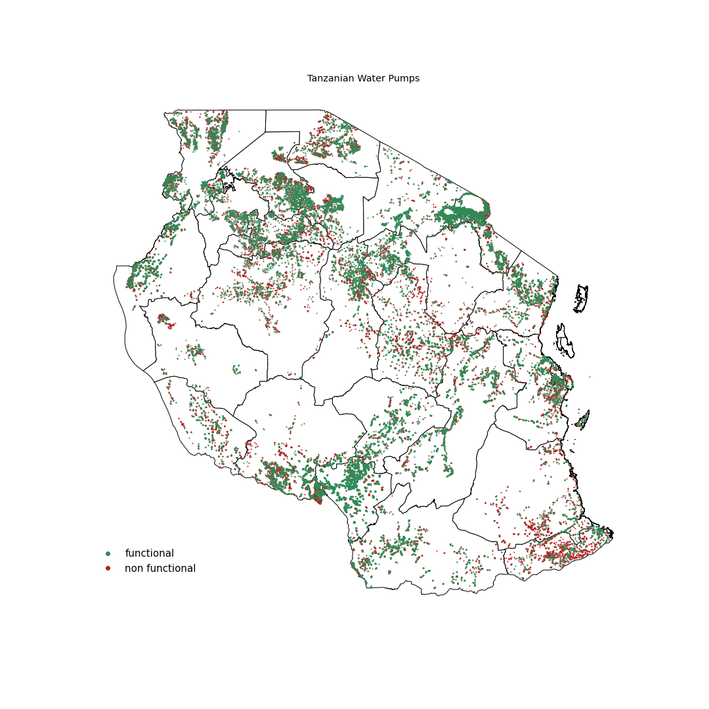

# Predictive Modeling for Tanzanian Wells 


**Team:** Jennifer Cobb, Nick Indorf, Alex Marshall

## Overview

This project analyses the functionality status of 59,000 waterpoints overseen by the Tanzanian Ministry of Water to develop a binary classification  model to predict said status. The Ministry of Water will use to identify what waterpoints are non-functional and in need of repair. 


## Business Understanding 

While the country of Tanzania has abundant water resources including Lake Victoria, the largest lake in Africa, nearly 50% of the waterpoints overseen by the Ministry of Water are non-functional, leaving large segments of the population without a reliable or potable source of water. The Ministry will use the model to allocate repair resources so that they can be effectively deployed, increasing the number of Tanzanians with access to potable water. The model needed to take into consideration the fact that if wells were incorrectly identified as being functional then communities would be left without water, and conversely if the model identified working wells as broken the Ministry would not be able to allocate their resources effectively.

<p align="center">
  
</p>

## Data Understanding

We used the a dataset compiled by the [Ministry of Water](https://www.maji.go.tz/) and [TAARIFA](https://taarifa.org/) and available at [DataDriven.org](https://www.drivendata.org/competitions/7/pump-it-up-data-mining-the-water-table/).  The dataset describes over 59,000 waterpoints and includes features for each point such as location, water quality, funding agency, etc. The majority of the dataset's 40 features contain categorical data while only 10 contained numeric data.  


## Modeling

After creating a baseline model using DummyClassifier with poor results we created additional, simple, Logistic Regression and Decision Tree models. Preprocessing steps were integrated into the modeling process by use of Pipelines, and models scoring was analyzed to determine next steps via use of a bespoke evaluate function. 


*sample of evaluate function output*


## Evaluation

After iterating through numerous models we found that a voting classifier that used a combination of Adaboost and Random Forest estimators produced not only the highest accuracy score, 82.7%, but also maintained high precision and recall values, 83.4% and 77.3% respectively, unlike other models where an increase in accuracy was often accompanied by a drip in either or both of those metrics.  Given the large amount of categorical data in our model the success of the Random Forest estimator was not surprising, and the model was further improved by Adaboost's ability to enhance the performance of decision tree based estimators.  

## Next Steps

Moving forward we would like to perform the following actions to improve the data quality and therefore our model's accuracy:

**Revise data collection processes** - Currently a large amount of redundant data is being collected on the waterpoints. By refining the data collection process we can obtain better quality (and less confusing) data as well as reduce the amount of time needed by those collecting the data to perform their job. 

**Integrate external geodata** - The current data set has some values that do not need to be collected in the field as they can be gained via GIS processing as we have the longitude and latitude for each waterpoint. Leveraging this external data, much of which is in the public domain, further streamlines the data collection process for each waterpoint and increases the accuracy of the dataset's features.

**Expand number of classifiers in model** - Expand the model from a binary classifier to a trinary classifier so in addition to identifying "functioning" and "non functioning" waterpoints it can also identfy waterpoints that are functioning but need repair. 

## For More Information

See the full analysis in the [Jupyter Data Cleaning Notebook](./Data_Cleaning_Final.ipynb) and the [Jupyter Modeling Notebook](./Modeling_Final.ipynb) or review this [presentation](./Water_Wells_Presentation.pdf).

## Repository Structure

```

├── images
├── notebooks  #each team member's notebook file contains jupyter notebooks used in the development of the final model
│   ├── Alex
│   ├── Jen
│   └── Nick    
├── .gitignore
├── README.md
├── Data_Cleaning_Final.ipynb
├── Modeling_Final.ipynb
└── Water_Wells_Presentation.pdf
```


